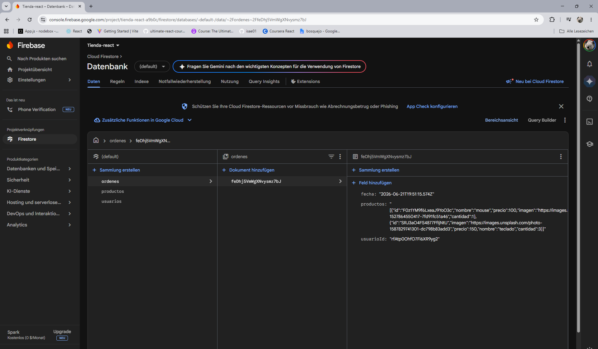

# Mini Tienda en Línea - React Fundamentos

Proyecto final del curso React Fundamentos.

## Descripción

Esta aplicación es una mini tienda en línea desarrollada con React. Permite que un usuario ingrese con su correo, vea productos cargados desde Firestore, agregue productos al carrito, ingrese una orden y consulte sus órdenes creadas.

## Tecnologías utilizadas

- React
- Vite
- Firebase Firestore
- Tailwind CSS
- JavaScript
- LocalStorage

## Funcionalidades

- Login por correo electrónico.
- Creación automática de usuario en Firestore si no existe.
- Guardado del ID del usuario en LocalStorage.
- Catálogo de productos obtenido desde Firestore.
- Selección de cantidad por producto.
- Carrito de compras con subtotal y total general.
- Registro de órdenes en Firestore.
- Guardado de productos usando JSON.stringify.
- Visualización de órdenes por usuario usando JSON.parse.

## Colecciones de Firestore

El proyecto utiliza las siguientes colecciones:

- productos
- usuarios
- ordenes

## Evidencias de Firestore

### Colecciones



## Instalación y ejecución

Para ejecutar el proyecto:

```bash
npm install
npm run dev
```
